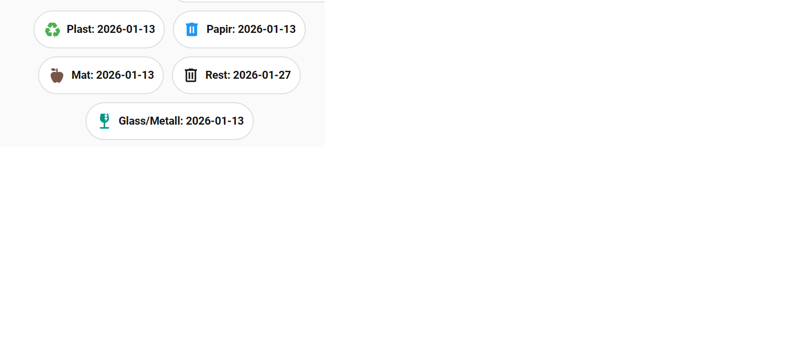

# HRA Renovasjon

[](https://github.com/hacs/integration)


Home Assistant integration of the norwegian HRA Renovasjon app (HRA App). Special for Ringerike, Lunner,Hole og Jevnaker 

Based and Credit to : https://github.com/eyesoft/home_assistant_min_renovasjon/.  Only changed the api / decode part to suit HRA API
## Installation
Under HACS -> Integrations, add custom repository "https://github.com/SEspe/home_assistant_HRA_renovasjon/ with Category "Integration". 

Search for repository "HRA_Renovasjon" and download it. Restart Home Assistant.

Go to Settings > Integrations and Add Integration "HRA Renovasjon". Type in address to search, e.g. "Min gate 12, 0153" (street address comma zipcode).

Click Configure and choose fractions to create sensors.

Restart Home Assistant.

Sensors

plastemballasje
papir_papp_og_kartong
matavfall
restavfall
glass_og_metallemballasje

Sennsors has state and attributes
['next_date', 'next_dates', 'route_name', 'frequency', 'fraction_id', 'fraction_guid', 'days_to_pickup', 'icon', 'friendly_name']

Card



<details>
    <summary>Show yaml</summary>

```yaml
type: custom:mushroom-chips-card
chips:
  - type: template
    icon: mdi:recycle
    icon_color: green
    content: "Plast: {{ states('sensor.plastemballasje') }}"
  - type: template
    icon: mdi:trash-can
    icon_color: blue
    content: "Papir: {{ states('sensor.papir_papp_og_kartong') }}"
  - type: template
    icon: mdi:food-apple
    icon_color: brown
    content: "Mat: {{ states('sensor.matavfall') }}"
  - type: template
    icon: mdi:trash-can-outline
    icon_color: gray
    content: "Rest: {{ states('sensor.restavfall') }}"
  - type: template
    icon: mdi:glass-fragile
    icon_color: teal
    content: "Glass/Metall: {{ states('sensor.glass_og_metallemballasje') }}"
alignment: center

```

</details>

## Debugging
in configuration.yaml

```yaml
logger:
  default: info
  logs:
    custom_components.hra_renovation: debug
```