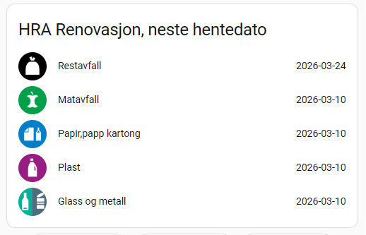
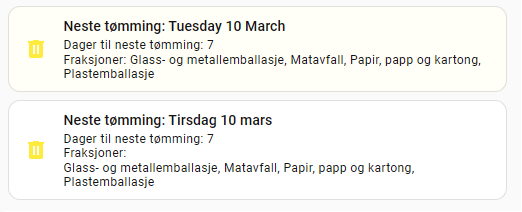

# HRA Renovasjon

[](https://github.com/hacs/integration)


Home Assistant integration of the norwegian HRA Renovasjon app (HRA App). Special for Ringerike, Lunner,Hole og Jevnaker

Denne integrasjonen er laget for HRA Renovasjon (Hallingdal og Ringerike Avfallsselskap). 
Støtter kommunene Ringerike, Hole, Jevnaker, osv.

Based and Credit to : https://github.com/eyesoft/home_assistant_min_renovasjon/.  Only changed the api / decode part to suit HRA API
## Installation
Under HACS -> Integrations, add custom repository "https://github.com/SEspe/home_assistant_HRA_renovasjon/ with Category "Integration". 

Search for repository "HRA_Renovasjon" and download it. Restart Home Assistant.

Go to Settings > Integrations and Add Integration "HRA Renovasjon". Type in address to search, e.g. "Min gate 12, 0153" (street address comma zipcode).

Sensors are created automatically for every fraction found for your address.

Sensors

Basic sensors are named:

plastemballasje
papir_papp_og_kartong
matavfall
restavfall
glass_og_metallemballasje

Sensors has state and attributes
['next_date', 'next_dates', 'route_name', 'frequency', 'fraction_id', 'fraction_guid', 'days_to_pickup', 'icon', 'friendly_name']

Computed sensors:
hra_renovasjon_next_date  with attributea days_to_pickup and fractions


Card

<details>
    <summary>Show yaml</summary>

```yaml
type: entities
title: HRA Renovasjon, neste hentedato
entities:
  - entity: sensor.restavfall
    name: Restavfall
  - entity: sensor.matavfall
    name: Matavfall
  - entity: sensor.papir_papp_og_kartong
    name: Papir,papp kartong
  - entity: sensor.plastemballasje
    name: Plast
  - entity: sensor.glass_og_metallemballasje
    name: Glass og metall
```
</details>

Card



<details>
    <summary>Show yaml</summary>

```yaml EN
type: custom:mushroom-template-card
entity: sensor.hra_renovasjon_next_date
primary: >
   Neste tømming: 
    {{ (as_datetime(d) | as_local).strftime('%A %d %B') | title }}
  
    Ukjent
  
secondary: >
  Dager til neste tømming: {{ state_attr('sensor.hra_renovasjon_next_date',
  'days_to_pickup') }}

  Fraksjoner: {{ state_attr('sensor.hra_renovasjon_next_date', 'fractions') }}
icon: mdi:trash-can
multiline_secondary: true
tap_action:
  action: more-info
features_position: bottom
grid_options:
  columns: 12
  rows: auto
color: >
   
    red
  
    orange
  
    yellow
  
    green
  
```

```yaml NO
type: custom:mushroom-template-card
entity: sensor.hra_renovasjon_next_date
primary: >
   Neste tømming: 

    

    {% set ukedag = {
      'Monday':'Mandag','Tuesday':'Tirsdag','Wednesday':'Onsdag',
      'Thursday':'Torsdag','Friday':'Fredag','Saturday':'Lørdag','Sunday':'Søndag'
    }[dt.strftime('%A')] %}

    {% set måned = {
      'January':'januar','February':'februar','March':'mars','April':'april',
      'May':'mai','June':'juni','July':'juli','August':'august',
      'September':'september','October':'oktober','November':'november','December':'desember'
    }[dt.strftime('%B')] %}

    {{ ukedag }} {{ dt.strftime('%d') }} {{ måned }}

  
    Ukjent
  
secondary: >
  Dager til neste tømming: {{ state_attr('sensor.hra_renovasjon_next_date',
  'days_to_pickup') }}

  Fraksjoner: {{ state_attr('sensor.hra_renovasjon_next_date', 'fractions') }}
icon: mdi:trash-can
multiline_secondary: true
tap_action:
  action: more-info
features_position: bottom
grid_options:
  columns: 12
  rows: auto
color: >
   
    red
  
    orange
  
    yellow
  
    green
  


```
</details>

## Debugging
in configuration.yaml

```yaml
logger:
  default: info
  logs:
    custom_components.hra_renovasjon: debug
```
